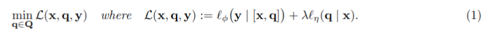

# Advprompter: Fast Adaptive Adversarial Prompting for LLMs  

## 基本概念 
在大型语言模型（LLM）的训练过程中，"token" 和 "indicator" 是两个关键概念，它们共同构成了模型理解和处理语言的基础。

#### Token（标记）: 
在自然语言处理（NLP）中，token 是指将文本分割成的最小单位，可以是单词、符号或者子词（subword）。例如，在英文中，一个句子 "I love AI." 可以被分割成三个 tokens: ["I", "love", "AI", "."]。在中文中，由于语言的特点，token 可能是单个汉字或者由多个汉字组成的词语。Tokenization（标记化）是将文本转换成 tokens 的过程，这是 LLM 处理和理解文本的第一步。

#### Indicator（指示符）: 
在 LLM 的上下文中，indicator 通常指的是用来表示或标识某个特定 token 的符号或者数值。在模型内部，每个 token 都会被映射到一个唯一的数值，这个数值就是该 token 的 indicator。这些数值通常是词汇表（vocabulary）中的索引，词汇表包含了模型能够理解的所有 tokens。例如，如果词汇表中 "love" 的索引是 10，那么 "love" 这个 token 的 indicator 就是 10。在模型训练时，这些 indicators 会被用来构建输入数据的向量表示，进而通过神经网络进行学习和预测。

在训练过程中，模型会学习如何根据输入的 tokens 和它们的 indicators 来预测下一个 token 或者完成其他语言任务。通过这种方式，LLM 能够捕捉语言的统计规律和语义信息，从而生成连贯和有意义的文本。

设定V是Indicator的集合，词汇表用$\{1,...,N\}$表示，攻击者发出一个有害或者不当的指令$x \in X = V^{|x|}$，经过安全对齐的模型会拒绝回复。越狱攻击是一段后缀$q \in Q = V^{|q|}$，当这个后缀被加入到指令中的时候，会使得目标大语言模型产生一个期望的positive回复$y \in Y = V^{|y|}$。虽然也可以通过其他的方式来实施越狱攻击，但是本文以添加后缀的方式来进行越狱。我们用$[x,q]$表示adversarial prompt，用$[x,q,y]$表示full prompt，response y被嵌入到了chat template。  

找到最优的adversarial suffix等价于最小化正则化的adversarial loss $L: X \times Q \times Y → R$:  
  

这个Adversarial Loss $l_\phi$衡量在带有fixed parameters $\phi$的LLM下，产生positive回复y的概率，这个损失是以加权交叉熵损失函数的形式实现的：  

  

权重参数$γ_t = \frac{1}{t}$，这样可以促进第一个token回复为Sure的概率。公式1中的剩下一项正则化损失促进对抗提示的可读性，确保$[x,q]$形成连贯的自然文本。我们使用一个预训练的BaseLLM（其固定参数为η）的对数概率，以计算该正则化得分。  

  

我们设定一个solution mapping， 这个mapping将instruction-response pair映射为公式1中所优化的adversarial suffix：  

$$ q^* : X× Y → Q, i.e. q^*(x,y) \in argmin_{q\in Q} L(x,q,y)$$  

针对一组有害的问答对儿$D$，寻找一个简单的通用adversairal suffix $q^*$，意味着最小化：  

  

## 本文方法  

本文的思路基于拓展GCG等方法所提出的通用adversarial suffix，通过训练一个参数化模型$q_θ: X \rightarrow Q$来对前文所提到的solution mapping $q^*: X× Y → Q$进行近似求解。我们将$q_θ$称为AdvPrompter。  

  

本文求solution mapping近似解的方法是一个amortized optimization and learning to optimize 的过程。这个过程的关键是，训练AdvPrompter $q_θ$的成本是可分摊的，通过使用之前获得的信息，从相同的分布中解决新的优化问题的成本是cheap的。AdvPrompter以BaseLLMS开始初始化